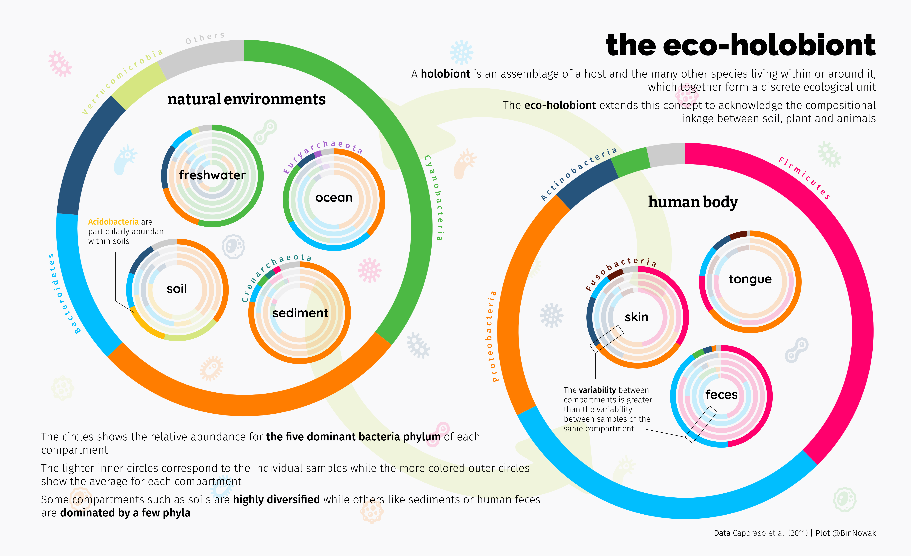
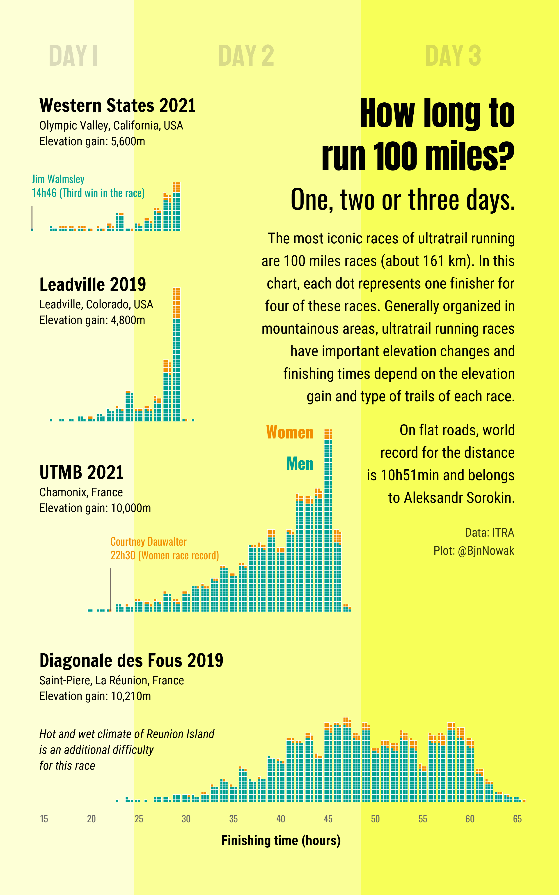
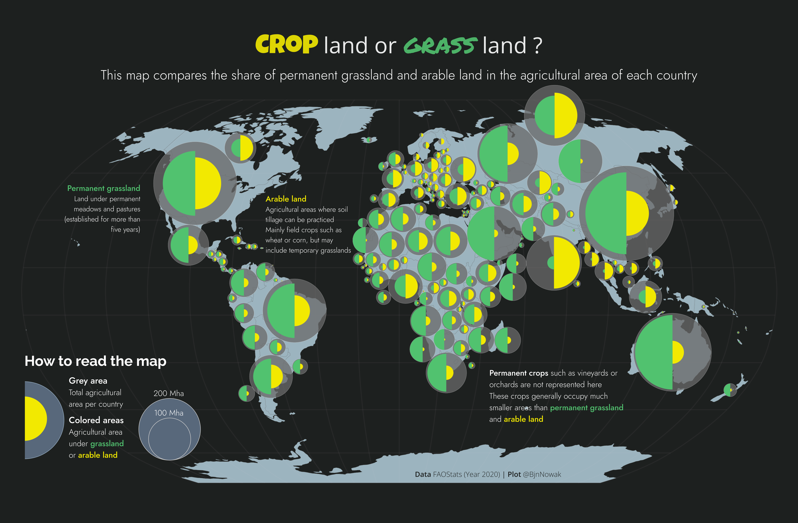
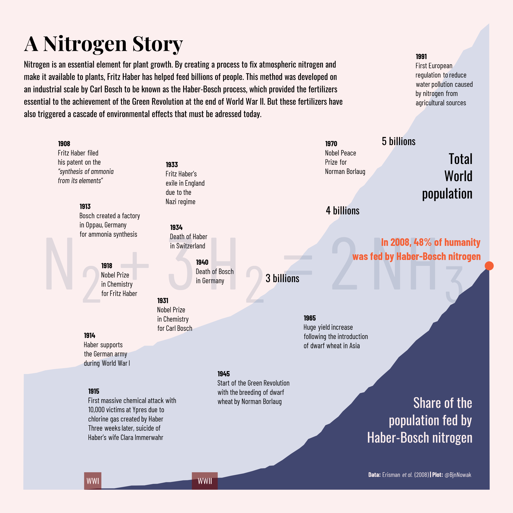
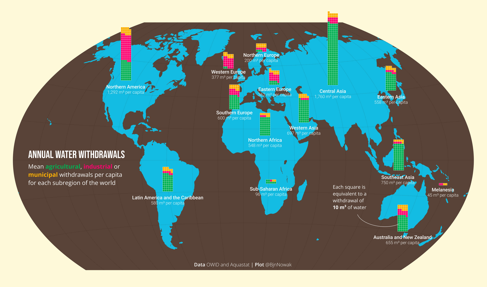

## Comparisons

**Day 1** Part-to-whole ([code](https://github.com/BjnNowak/TidyTuesday/blob/main/SC_Microbiome.R))

**Day 2** Waffle ([code](https://github.com/BjnNowak/TidyTuesday/blob/main/SC_Ultra_Distribution.R))

**Day 3** Fauna/Flora ([code](https://github.com/BjnNowak/TidyTuesday/blob/main/SC_Arableland.R))

**Day 4** Historical ([code](https://github.com/BjnNowak/TidyTuesday/blob/main/SC_Haber.R))

**Day 5** Slope ([code](https://github.com/BjnNowak/TidyTuesday/blob/main/SC_farm_size.R))

**Day 6** Data Day: Our World in Data ([code](https://github.com/BjnNowak/TidyTuesday/blob/main/SC_irrigation.R))

<a href="https://bjnnowak.github.io/30DayChartChallenge/">Back to main page</a> - <a href="https://bjnnowak.github.io/30DayChartChallenge/distributions.html">Next</a>

