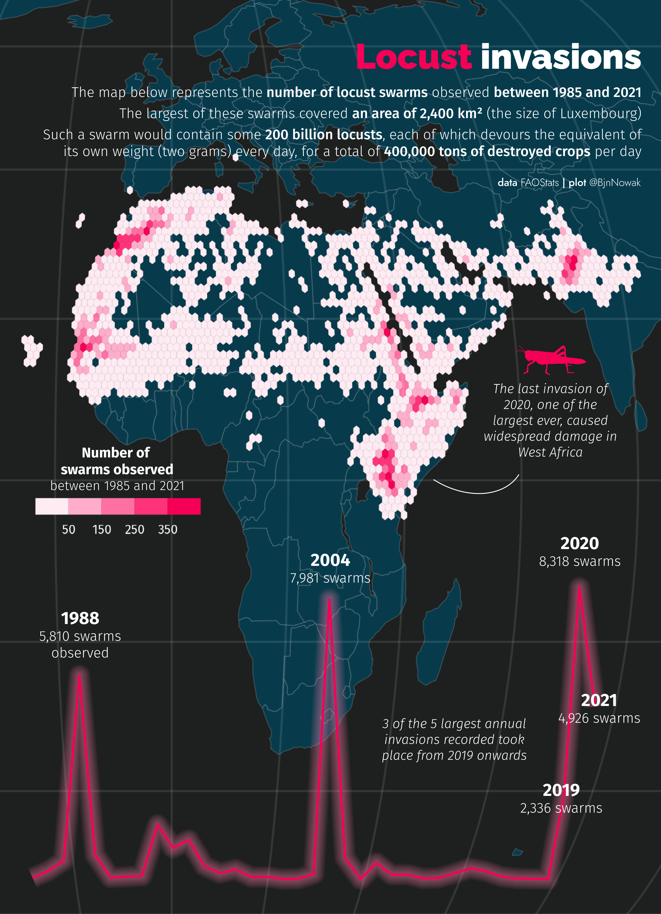
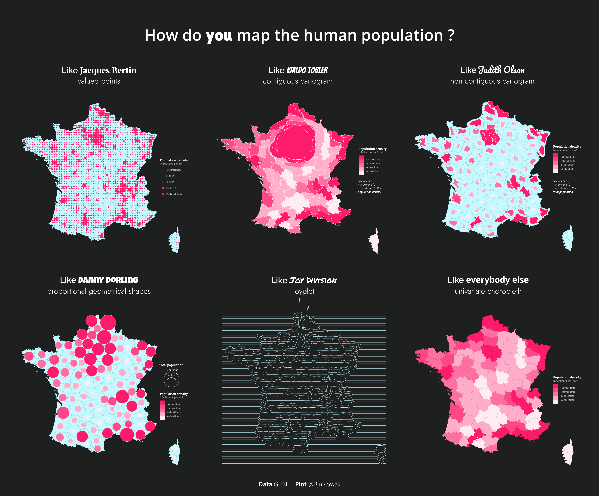
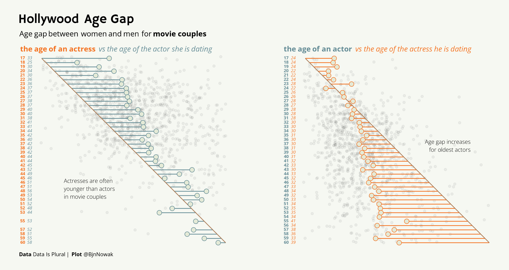
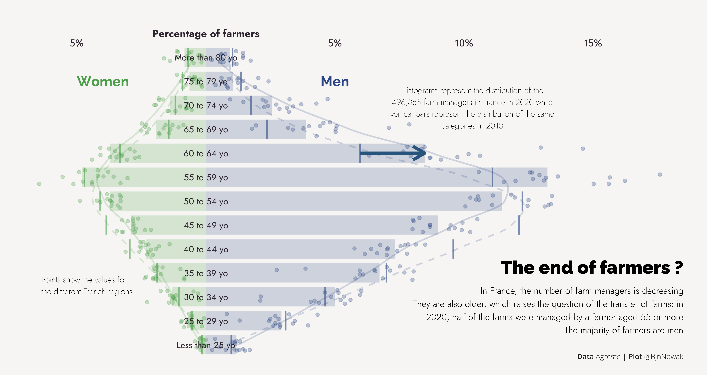
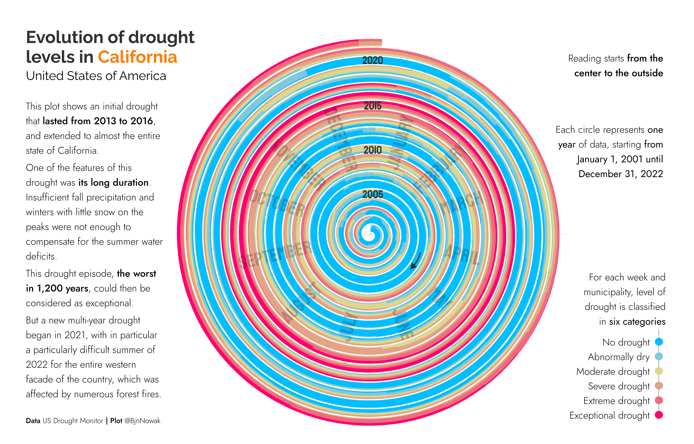
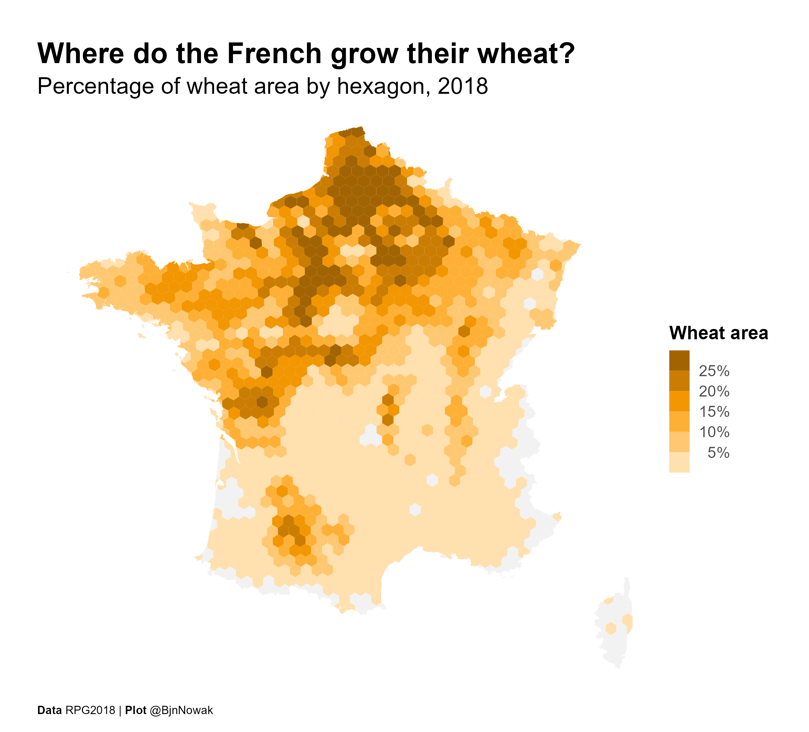

## Distributions

**Day 7** Hazards ([code](https://github.com/BjnNowak/TidyTuesday/blob/main/SC_Locust.R)))

**Day 8** Humans ([code](https://github.com/BjnNowak/TidyTuesday/blob/main/SC_HumanPop.R))

**Day 9** High/Low ([code](https://github.com/BjnNowak/TidyTuesday/blob/main/SC_AgeGap.R))

**Day 10** Hybrid ([code](https://github.com/BjnNowak/TidyTuesday/blob/main/SC_age.R))

**Day 11** Circular ([code](https://github.com/BjnNowak/TidyTuesday/blob/main/SC_Drought_Spiral.R))

**Day 12** Theme day: BBC News ([code](https://github.com/BjnNowak/TidyTuesday/blob/main/SC_BBC.R))

<a href="https://bjnnowak.github.io/30DayChartChallenge/comparisons.html">Previous</a> - <a href="https://bjnnowak.github.io/30DayChartChallenge/">Back to main page</a> - <a href="https://bjnnowak.github.io/30DayChartChallenge/relationships.html">Next</a>

