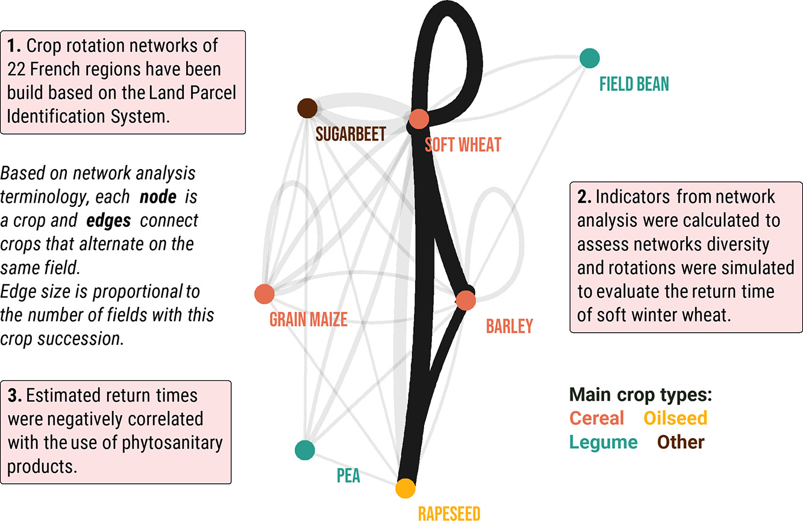

## Relationships

**Day 13** Pop Culture ([code](https://github.com/BjnNowak/TidyTuesday/blob/main/SC_Oasis.R))

**Day 14** New Tool

**Day 15** Positive/Negative ([code](https://github.com/BjnNowak/TidyTuesday/blob/main/SC_TimeZone.R))

**Day 16** Family 

**Day 17** Networks (link to [full paper](https://www.sciencedirect.com/science/article/abs/pii/S0308521X22000385))

**Day 18** Data day: Eurostat ([code](https://github.com/BjnNowak/TidyTuesday/blob/main/SC_Eurostats.R))

<a href="https://bjnnowak.github.io/30DayChartChallenge/distributions.html">Previous</a> - <a href="https://bjnnowak.github.io/30DayChartChallenge/">Back to main page</a> - <a href="https://bjnnowak.github.io/30DayChartChallenge/time_series.html">Next</a>

