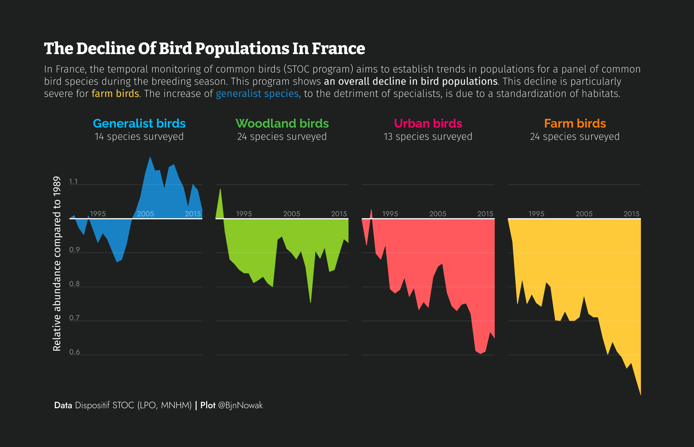
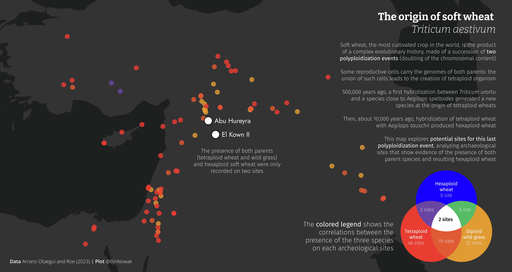
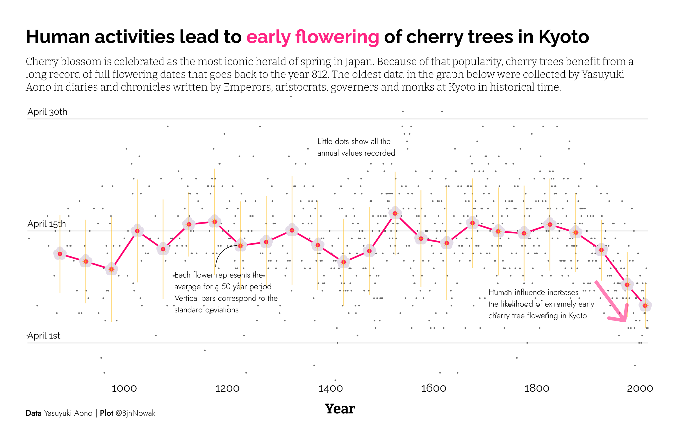
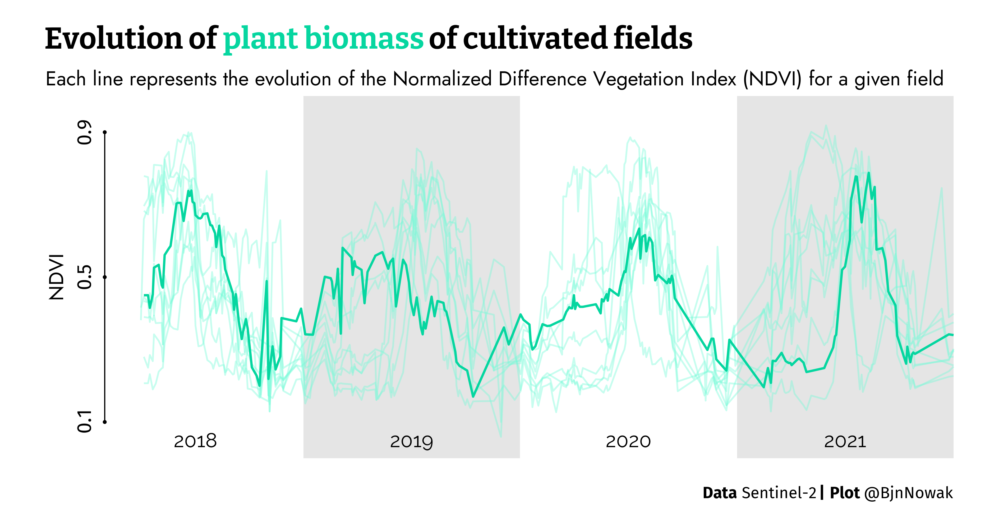
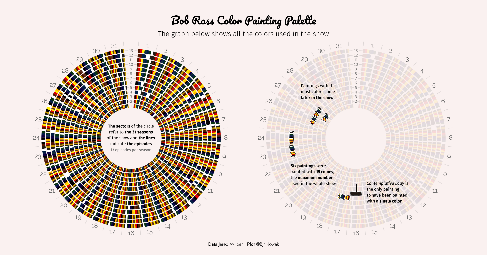
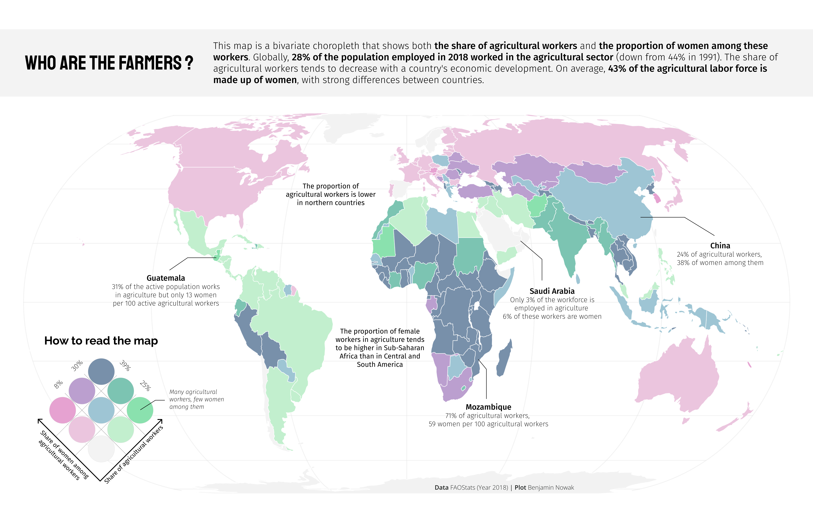

## Relationships

**Day 19** Anthropocene ([code](https://github.com/BjnNowak/TidyTuesday/blob/main/SC_Birds.R))

**Day 20** Correlation([code](https://github.com/BjnNowak/TidyTuesday/blob/main/SC_WheatOrigin.R))

**Day 21** Down/Upwards ([code](https://github.com/BjnNowak/TidyTuesday/blob/main/SC_cherry.R))

**Day 22** Green energy ([code](https://github.com/BjnNowak/TidyTuesday/blob/main/SC_NDVI.R))

**Day 23** Tiles ([code](https://github.com/BjnNowak/TidyTuesday/blob/main/SC_BobRoss.R))

**Day 24** Theme day: UN Women ([code](https://github.com/BjnNowak/TidyTuesday/blob/main/SC_UNWomen.R))

<a href="https://bjnnowak.github.io/30DayChartChallenge/relationships.html">Previous</a> - <a href="https://bjnnowak.github.io/30DayChartChallenge/">Back to main page</a> - <a href="https://bjnnowak.github.io/30DayChartChallenge/uncertainties.html">Next</a>

