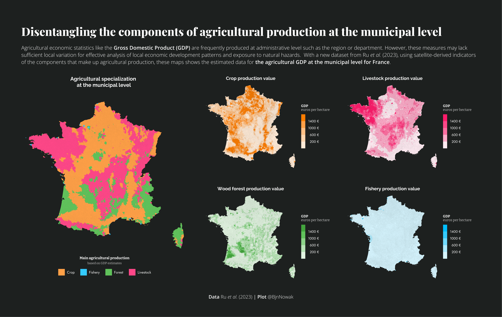

## Relationships

**Day 25** Global Change ([code](https://github.com/BjnNowak/TidyTuesday/blob/main/SC_drawdown.R))

**Day 26** Local Change ([code](https://github.com/BjnNowak/TidyTuesday/blob/main/SC_Anses.R))

**Day 27** Good/Bad ([code](https://github.com/BjnNowak/TidyTuesday/blob/main/SC_language.R))

**Day 28** Trend ([code](https://github.com/BjnNowak/TidyTuesday/blob/main/SC_Wheat_Trend.R))

**Day 29** Monochrome ([code](https://github.com/BjnNowak/TidyTuesday/blob/main/SC_Wheat_Trend_France.R))

**Day 30** Trend ([code](https://github.com/BjnNowak/TidyTuesday/blob/main/SC_Production.R))

